# evote-movie-2020-20-publish-to-fortrabbit

Publish our website to **Fortrabbit**, a PHP-As-A-Service hosting provider. We'll also add a reset DB link in the footer.

- [Fortrabbit.com](https://www.fortrabbit.com/)

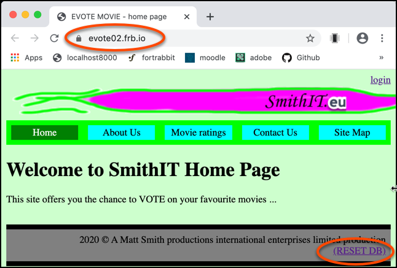

- update our DB config file, so it can detect whether we are running locally, or in Fortrabbit. Change the contents of `/config/dbConstants.php` to the following:

    ```php
    <?php
    
    $isFortrabbit = getenv('MYSQL_USER');
    
    if($isFortrabbit){
        // --- FORTRABBIT ---
        $host = getenv('MYSQL_HOST');
        $port = getenv('MYSQL_PORT');
        $host = "$host:$port";
        $user = getenv('MYSQL_USER');
        $password = getenv('MYSQL_PASSWORD');
        $database = getenv('MYSQL_DATABASE');
    } else {
        // --- LOCAL ---
        $host = 'localhost:3306';
        $database = 'evote';
        $user = 'root';
        $password = 'passpass';
    }
    
    define('DB_HOST', $host);
    define('DB_USER', $user);
    define('DB_PASS', $password);
    define('DB_NAME', $database);
    ```
  
    - if we are running in Fortrabbit then the special PHP environment variable `MYSQL_USER` will have a value. We use this to set a Boolean flag `$isFortrabbit`. If running in Fortrabbit, we'll set values for the DB configuration from the other Fortrabbit special environment variables (so our app will use the MySQL DB hosted by Fortrabbit for our app). If not, then we'll set the 4 special DB constants as usual to run in a local MySQL server.
    
- to save us having to log-in via SSH to run our DB migrations, let's add a link in the footer for a new `resetDatabase` action. Add the following to the footere in Twig `/templates/_base.html.twig`;
    
    ```twig
    <footer>
        2020 &copy; A Matt Smith productions international enterprises limited production
        <br>
        <a href="/index.php?action=resetDatabase">(RESET DB)</a>
    </footer>
    ```
  
- now we need to add a new `case` in our WebApplication Front Controller `switch(...)` statement, that recognises action `resetDatabase` and runs our 2 migrations and fixture scripts:

    ```php
    case 'resetDatabase':
        print '<a href="/">home</a><hr>';
        require_once __DIR__ . '/../db/migrateAndLoadUserFixtures.php';
        require_once __DIR__ . '/../db/migrationAndFixtures.php';
        break;
    ```

To publish on Fortrabbit we need to:

1. Create a new PHP app in Fortrabbit

    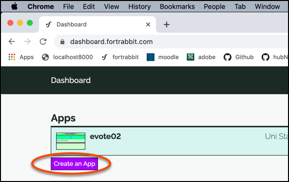

1. choose PHP

    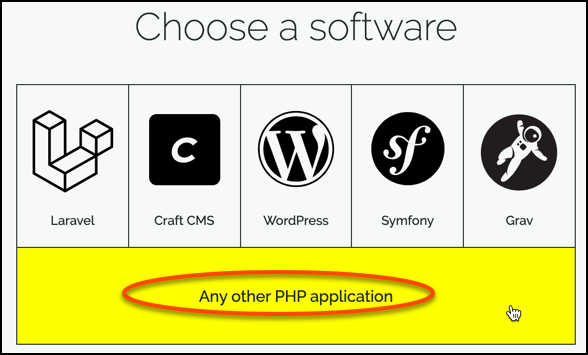

1. set the web root to `/public`

    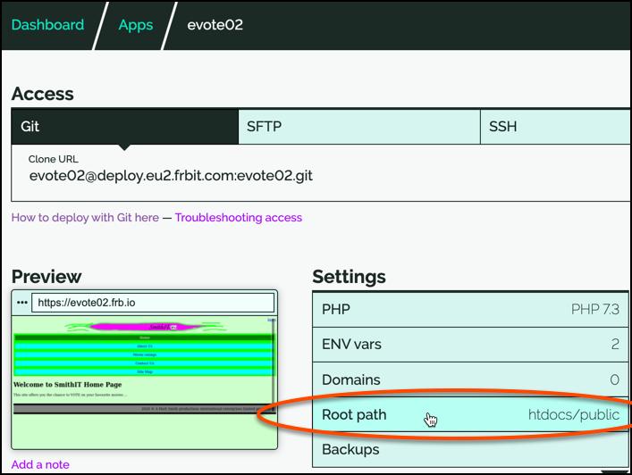
    
    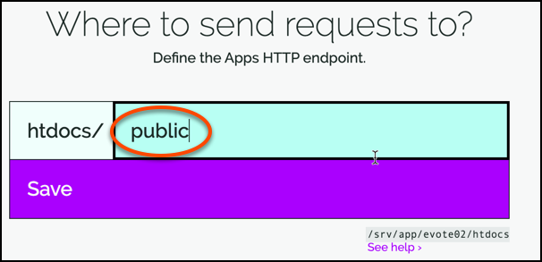

1. clone the repo ot your local machine

    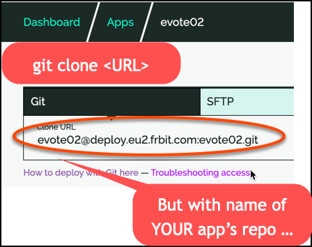

1. copy your project files into the newly created cloned project folder

1. `git add .`

1. `git commit -m "added files to project"`

1. `git push`

1. Now visit your website - via link at Fortrabbi

    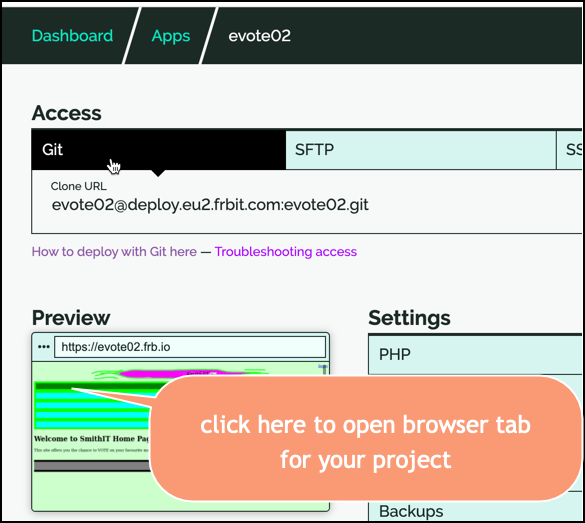

1. Run the DB reset script

    

1. and click `home` link when DB reset information displayed

    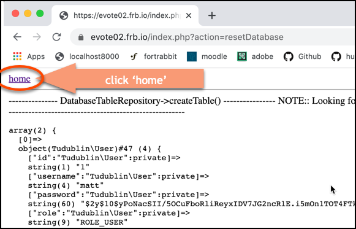

1. it should all work fine :-)


NOTE: You may have to set up SSH keys to work with Fortrabbit:

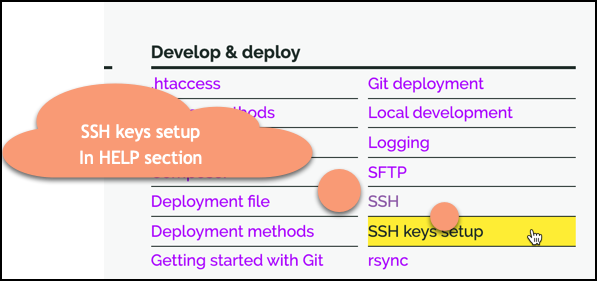


## MySQL queries

You can use an SSH tunnel to use your local MySQL terminal to connect to and query the remote Fortrabbit database

- follow the MySQL help steps from the Fortrabbit App dashboard

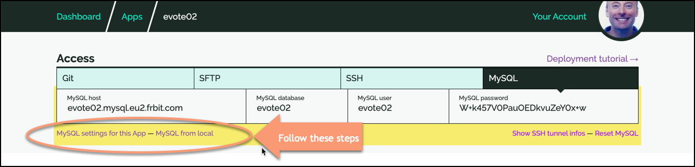

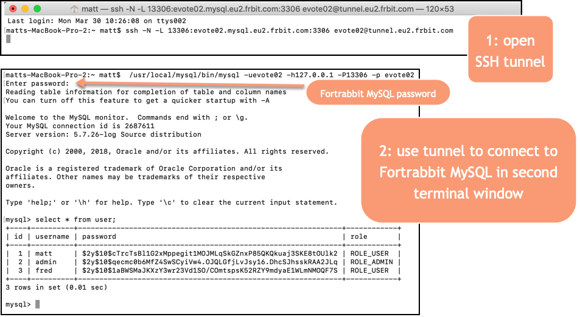

